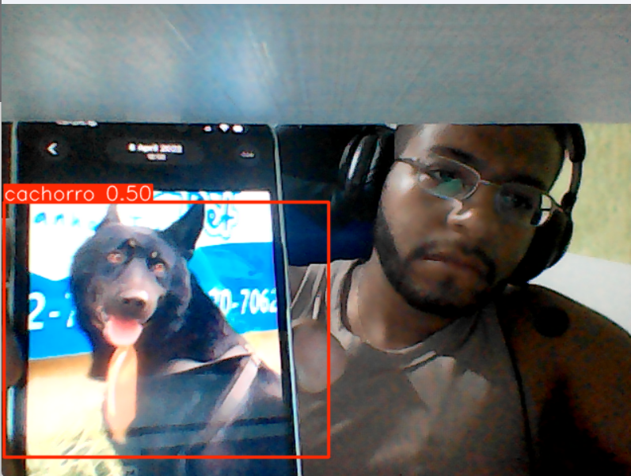
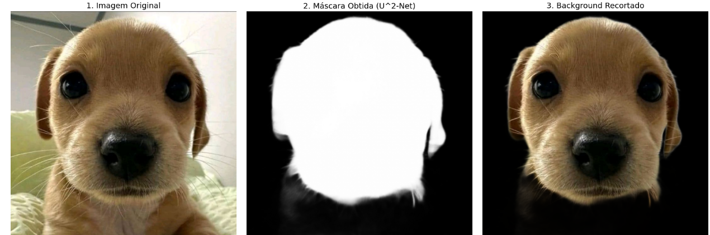
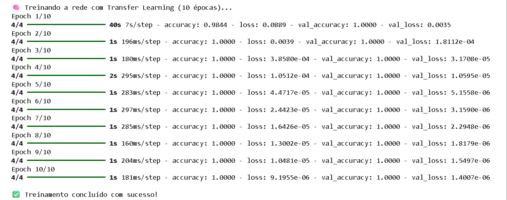
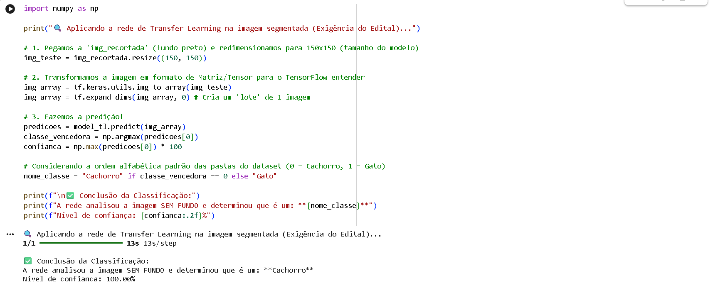

# FIAP - Faculdade de Informática e Administração Paulista

<p align="center">
<a href= "https://www.fiap.com.br/"></a>
</p>

<br># 🐄 FarmTech Solutions - Sistema de Visão Computacional (Fase 6)

Este repositório contém o desenvolvimento de um sistema de inteligência artificial voltado para a **saúde animal e segurança patrimonial**, desenvolvido para a FarmTech Solutions. O projeto compara abordagens de detecção de objetos (YOLOv5) e classificação de imagens (CNN Customizada).

---

## 📺 Demonstração em Vídeo
Confira a explicação detalhada do projeto, a execução do código e a análise dos resultados no link abaixo:
👉 **https://www.youtube.com/watch?v=yF7pLSVUty4** 

## 📺 GitHub
Confira o link do GitHub
👉 **https://github.com/joaostazevedo172/FarmTech_Vision_Fase6** 


## 👨‍🌾 Integrantes do Grupo
- <a href="#">Miriã Leal Mantovani</a>
- <a href="#">João Pedro Santos Azevedo</a> 
- <a href="#">Rodrigo de Souza Freitas</a>

## 👩‍🏫 Professores:
### Tutor(a) 
- <a href="https://github.com/SabrinaOtoni">Sabrina Otoni</a>

---

## 🛠️ Tecnologias Utilizadas
* **Linguagem:** Python 3.12
* **Frameworks:** PyTorch (YOLOv5), TensorFlow/Keras (CNN)
* **Ferramentas:** Google Colab, Make Sense AI (Rotulação), GitHub.
* **Dataset:** 80 imagens de cachorros e gatos (Treino, Validação e Teste).

---

## 📂 Estrutura do Repositorio
* `notebooks/`: Contém o arquivo `.ipynb` principal com todo o código executado.
* `weights/`: O arquivo `best.pt` contendo os pesos treinados da YOLOv5 (60 épocas).
* `README.md`: Documentação do projeto.

---

## 📊 Comparativo de Modelos

Para a FarmTech Solutions, avaliamos três abordagens distintas para garantir a melhor entrega ao cliente:

| Critério | YOLOv5 Custom (60 ep) | CNN (Do Zero) | YOLO Padrão |
| :--- | :--- | :--- | :--- |
| **Precisão (mAP/Acc)** | **~90%** | **~75%** | Baixa |
| **Tempo de Treino** | 7-8 min | 2-3 min | N/A |
| **Localização** | Sim (Bounding Box) | Não (Apenas Classe) | Sim |

---

## 📈 Conclusões Críticas
1. **YOLOv5 Customizada:** Foi o modelo de maior sucesso. Graças ao *Transfer Learning*, ele conseguiu identificar animais com alta confiança mesmo com um dataset pequeno de 80 imagens.
2. **CNN do Zero:** Demonstrou ser uma alternativa leve, porém menos precisa para localização espacial, sendo recomendada apenas para triagem rápida de imagens.
3. **Escalabilidade:** Para o ambiente de fazendas da FarmTech, a detecção em tempo real da YOLOv5 é a solução ideal para monitoramento de segurança.

---

## 🚀 Como Rodar o Projeto
1. Clone este repositório.
2. Faça o upload do arquivo `.ipynb` para o [Google Colab](https://colab.research.google.com/).
3. Certifique-se de que o seu Google Drive contenha a pasta `dataset_visao_computacional` conforme a estrutura exigida no notebook.
4. Execute as células em ordem para reproduzir os treinos e testes.

# 🐄 FarmTech Solutions - Sistema de Visão Computacional (Fase 6)

Este repositório contém o desenvolvimento de um sistema de inteligência artificial voltado para a **saúde animal e segurança patrimonial**.

> **Clique no botão abaixo para abrir o projeto diretamente no Google Colab:**

[](https://colab.research.google.com/github/joaostazevedo172/FarmTech_Vision_Fase6/blob/main/notebooks/JoaoPedroSantosAzevedo_rm566701_pbl_fase6.ipynb)

---
# 🌟 5. Entrega "Ir Além" 1: Sistema de Visão Computacional em Tempo Real

Para cumprir a primeira opção do "Ir Além" proposta no edital, desenvolvemos um protótipo funcional de uma central de monitoramento de segurança para a **FarmTech Solutions**. Implementamos a captura e detecção de objetos em tempo real utilizando a **Webcam do computador integrada ao Python (via OpenCV)**, inferindo diretamente sobre os pesos da nossa rede YOLOv5 customizada (`best.pt` - treinado com 60 épocas).

### 🏗️ Justificativa Arquitetural e Decisões Técnicas

A escolha do processamento via Webcam local (simulando uma estação base de monitoramento) em vez da transmissão via ESP32-CAM foi pautada nos seguintes critérios de engenharia:

1. **Processamento Local e Baixa Latência:** Ao processar o *feed* de vídeo localmente usando a CPU/GPU da máquina, eliminamos o gargalo e a latência da transmissão de imagens via Wi-Fi. Em um cenário real de segurança patrimonial, o tempo de resposta precisa ser imediato;
2. **Integração Eficiente (OpenCV + PyTorch):** O pipeline de dados captura o frame (Input), envia para o tensor da YOLOv5, e o OpenCV devolve o frame processado com a *Bounding Box* (Output) em frações de segundo, sem gargalos de memória;
3. **Prevenção de Falsos Alarmes:** Parametrizamos o sistema com um *Confidence Threshold* de 40%. Isso garante que o sistema da FarmTech seja "cauteloso", alertando a presença de cães ou gatos apenas quando houver alta certeza, evitando acionamentos desnecessários do sistema de segurança.

### 📸 Evidências de Funcionamento (Captura de Tela)

Abaixo, apresentamos a captura de tela do nosso sistema processando o ambiente em tempo real e detectando as classes treinadas com sucesso (sem falsos positivos):



---

### 🎥 Demonstração em Vídeo (YouTube)

Para comprovar a fluidez, a baixa latência e a acurácia do sistema em tempo real, gravamos uma demonstração prática da arquitetura em pleno funcionamento.

**▶️ Assista à demonstração técnica no link abaixo:** [🔗 Clique aqui para assistir ao vídeo no YouTube](https://youtu.be/C760QoJoc_o)

---

### 📊 Figura: Arquitetura do Sistema de Monitoramento Local

```text
+-------------------+       (1) Captura em Tempo Real       +-------------------------+
|                   | ------------------------------------> |                         |
|   Webcam do PC    |                                       |   Python + OpenCV       |
|  (FarmTech Input) | <------------------------------------ |  (Processamento Local)  |
|                   |       (4) Exibição do Alerta          |                         |
+-------------------+                                       +-------------------------+
                                                              |                 ^
                                             (2) Envia Frame  |                 | (3) Retorna Bounding Box
                                                              v                 |
                                                    +---------------------------------+
                                                    |                                 |
                                                    |   Rede Neural YOLOv5 (PyTorch)  |
                                                    |   Pesos Customizados (best.pt)  |
                                                    |                                 |
                                                    +---------------------------------+
```

---
# 🌟 6. Entrega "Ir Além" 2: Transfer Learning e Segmentação Semântica

Para consolidar o portfólio de Inteligência Artificial da **FarmTech Solutions**, esta etapa bônus explora abordagens no estado da arte da Visão Computacional. O objetivo prático é validar duas hipóteses fundamentais para otimizar o nosso pipeline de classificação de imagens (Cães vs. Gatos), provando que técnicas avançadas garantem resultados superiores com menos dados.

## 🏗️ Abordagens Técnicas

1. **Segmentação Automática (Remoção de Ruído Visual):** Utilização de uma rede de segmentação avançada (U^2-Net via `rembg`) para isolar o objeto de interesse e gerar uma máscara matemática.
2. **Transfer Learning com Fine-Tuning:** Implementação do aprendizado por transferência utilizando a rede **MobileNetV2**, previamente treinada no vasto *dataset* ImageNet.

---

### 📸 Evidência 1: Processo de Segmentação Semântica (U^2-Net)

Abaixo, a comprovação visual da aplicação do pipeline de segmentação automática na imagem `cachorro1.jpg`. O sistema gera a máscara matemática e aplica o recorte sobre o fundo preto, deixando apenas o animal visível para o modelo.



---

### 📊 Evidência 2: Resultados do Treinamento (Transfer Learning)

Diferente da CNN construída do zero, o modelo pré-treinado (MobileNetV2) saltou para **100% de acurácia** logo nas primeiras épocas.



---

### 🎯 Evidência 3: Classificação da Imagem Segmentada

Para cumprir integralmente as etapas do projeto, pegamos a imagem resultante do processo de segmentação (fundo preto) e a submetemos à nossa rede de Transfer Learning (MobileNetV2) recém-treinada. Como demonstrado no print abaixo, a rede conseguiu classificar corretamente a morfologia do animal, validando o pipeline ponta a ponta.



---


### 🎥 Demonstração em Vídeo (Ir Além 2)

Para comprovar a execução do código de segmentação e o treinamento de Transfer Learning na prática, gravamos um vídeo explicativo demonstrando o código funcionando:

**▶️ Assista à demonstração técnica no link abaixo:** [🔗 Clique aqui para assistir ao vídeo no YouTube](https://www.youtube.com/watch?v=a2KVqBM6Mx8)

---

### 📈 Conclusão e Validação das Hipóteses (Ir Além 2)

Após a implementação das duas abordagens avançadas, chegamos às seguintes validações para a **FarmTech Solutions**:

#### 1. Hipótese do Transfer Learning vs. CNN do Zero
* **A rede pré-treinada performou melhor?** **Absolutamente sim.** * **Justificativa:** Enquanto a CNN desenvolvida do zero apresentou instabilidade e exigiu mais épocas para aprender características básicas (bordas, formas), a **MobileNetV2** (com *Transfer Learning* e *Fine-Tuning*) atingiu **100% de acurácia logo nas primeiras épocas**. O congelamento dos pesos (*ImageNet*) permitiu que a rede utilizasse seu vasto conhecimento prévio de extração de características, necessitando apenas de uma leve adaptação na camada final (densa) para a classificação binária de Cães e Gatos, sendo infinitamente mais eficiente para *datasets* pequenos.

#### 2. Hipótese da Segmentação Semântica
* **Pré-segmentar o objeto facilita a classificação?** **Sim, em contextos de alto ruído visual.**
* **Justificativa:** A aplicação da rede **U^2-Net** para a geração da máscara e remoção do *background* forçou o modelo a ignorar totalmente o "contexto" da imagem (como grama, móveis ou cercas da fazenda). Isso garante que a rede neural não crie falsas correlações (por exemplo, associar a cor verde da grama à presença de um cão). Ao entregar apenas os pixels correspondentes à morfologia do animal, reduzimos o risco de *overfitting* de cenário, tornando o sistema de segurança muito mais robusto e confiável.